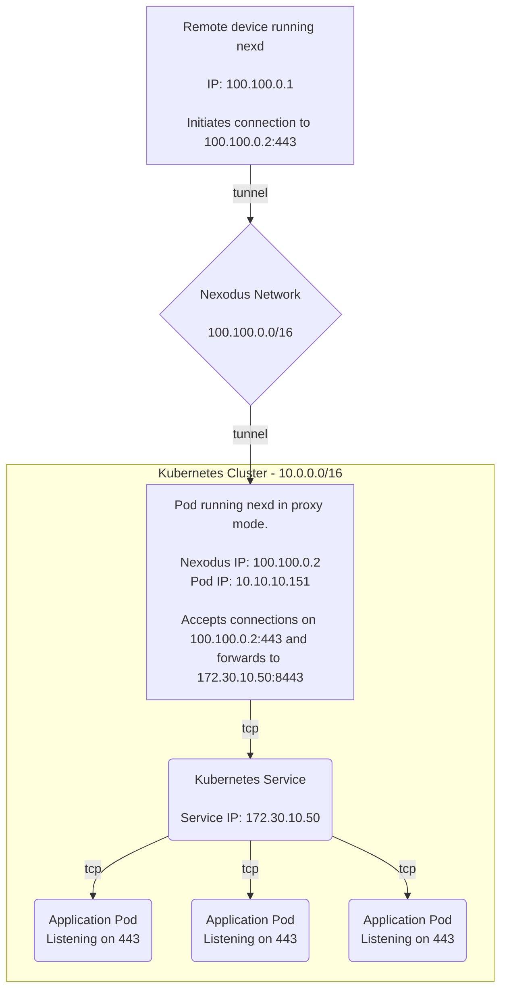
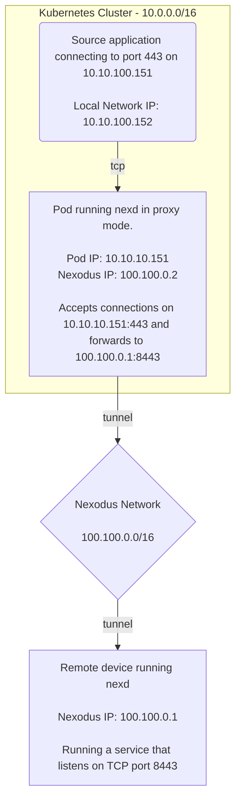
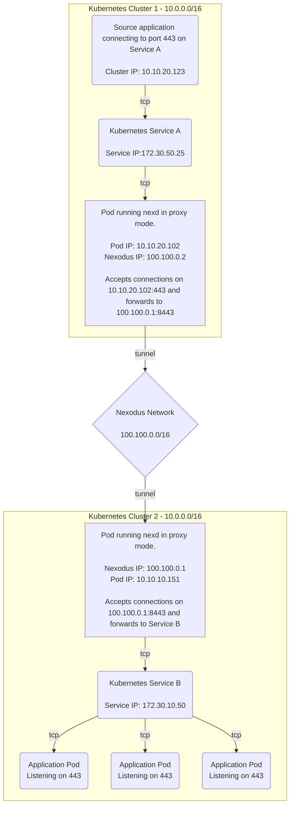

# Nexlink - Nexodus for Linking Kubernetes Services

> [Issue #706](https://github.com/nexodus-io/nexodus/issues/706)

## Summary

Develop a PoC to demonstrate how a higher-level networking abstraction can be built on top of Nexodus. Kubernetes will be used as the context for the PoC.

## Proposal

The default mode of running `nexd` requires privileges to create a network device. This prevents using it in a container environment without the ability to grant those extra privileges. [`nexd proxy`](userspace-mode.md) addresses this by allowing `nexd` to operate as an L4 proxy. However, the configuration of the L4 proxy is done in terms of port forwarding rules. For an application developer using Kubernetes, it is most convenient to define the desired network connectivity in terms of Kubernetes constructs. This proposal is to explore some approaches for using Nexodus to achieve connectivity to and from application resources in Kubernetes.

Before writing any new code, a few demos will be produced that demonstrate how connectivity with Nexodus works inside Kubernetes. By the end, we will produce some PoC code that automates the connectivity scenarios demonstrated in the demos.

### Demo 1 - Exposing a Kubernetes service over Nexodus

In this demo, we will provide a Kubernetes manifest that demonstrates how to run `nexd proxy` to forward connections to a Service inside of a cluster. This will allow any device within a Nexodus organization to reach this service, no matter where they are. For example, a developer's laptop could reach a service internal to a Kubernetes cluster running somewhere else, from a cloud provider to a corporate network.

In this example, the Pod running `nexd proxy` is using a single ingress proxy rule like this:

```sh
nexd proxy --ingress tcp:443:182.30.10.50:8443
```

The proxy rule could also refer to the Service by name instead of its IP address.

```sh
nexd proxy --ingress tcp:443:my-svc.my-namespace.svc.cluster.local:8443
```



### Demo 2 - Kubernetes Service to Reach a Resource Over Nexodus

This demo is similar to the first but in the reverse direction. It may be desirable for an application inside Kubernetes to reach a resource that is accessible within a Nexodus organization. An example here could be an application running in a public cloud that needs to reach a database running in a corporate data center.

In this example, the Pod running `nexd proxy` is using a single egress proxy rule like this:

```sh
nexd proxy --egress tcp:443:100.100.0.1:8443
```



### Demo 3 - Linking Kubernetes Services Across Clusters

This demo will show how to link two Kubernetes clusters together using Nexodus. This will allow an application in one cluster to reach a service in another cluster. This is similar to the previous demo, but the destination is a Kubernetes Service instead of a Nexodus device residing outside of a cluster.

In this example, we have one Pod running `nexd proxy` in each cluster. The Pod in cluster 1 is using a single egress proxy rule like this:

```sh
nexd proxy --egress tcp:443:100.100.0.1:8443
```

The Pod in cluster 2 is using a single ingress proxy rule like this:

```sh
nexd proxy --ingress tcp:8443:172.30.10.50:443
```

The ingress proxy rule could also refer to the Service by name instead of its IP address.

```sh
nexd proxy --ingress tcp:8443:my-svc.my-namespace.svc.cluster.local:443
```



### Nexlink - Automating the Configuration of Nexodus Proxy Rules

The previous sections describing three demo configurations to be produced show what connectivity scenarios are possible, but they all require manual setup. It should be possible to produce a new application that can automate the management of `nexd proxy` instances.

... TODO ...

## Alternatives Considered

### Gateway API

Adding Nexodus support for the Kubernetes [Gateway API](https://gateway-api.sigs.k8s.io/) is another integration point that should be explored, but was considered out-of-scope for this PoC.

## References

*Leave links to helpful references related to this proposal.*
